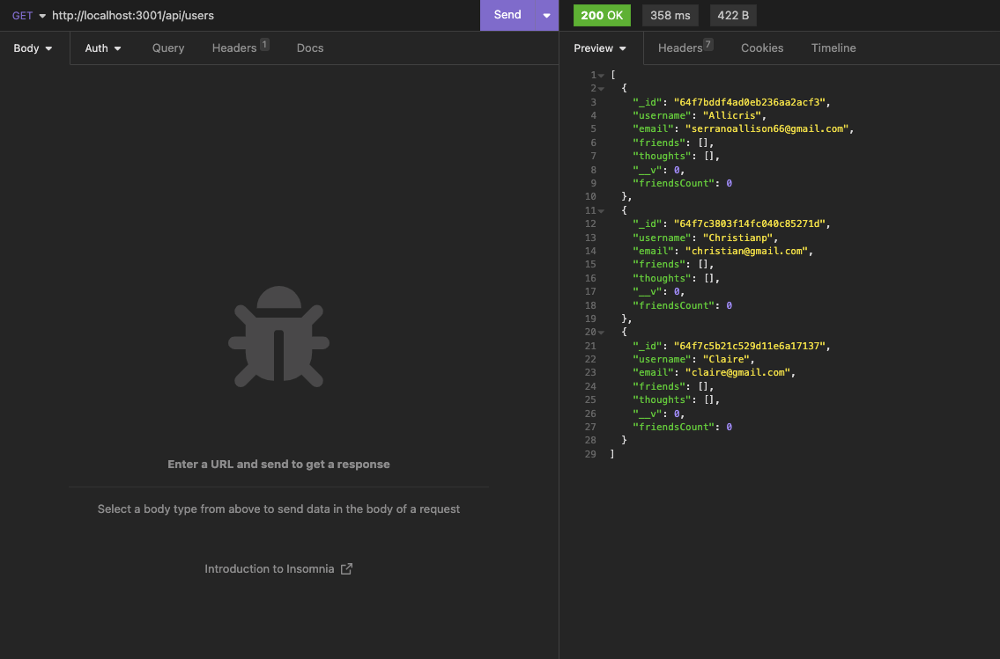
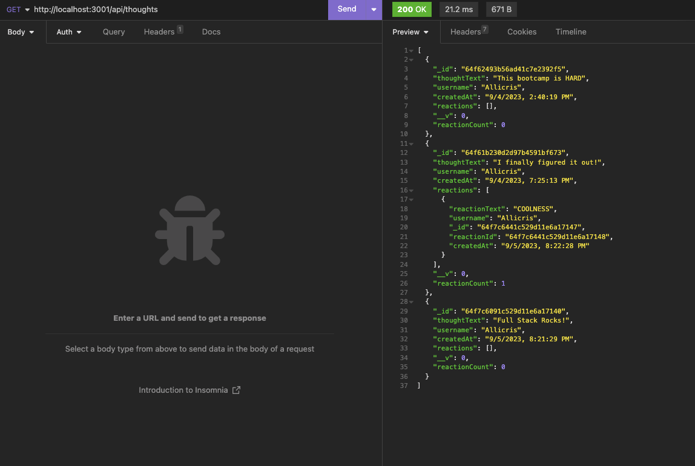

# NoSQL Social Media 

## Description
This application is for the purpose of creating, updating and deleting data from MongoDB and using mongoose to utilize and manipulate the data with API calls. 

## Table of Contents

-[User Story](#User-Story)

-[Acceptance Criteria](#Acceptance-Criteria)

-[Links](#Links)

-[Technologies Used](#Technologies-Used)

-[Screenshots](#Screenshots)

-[Author](#Author)


## User Story
```md
AS A social media startup
I WANT an API for my social network that uses a NoSQL database
SO THAT my website can handle large amounts of unstructured data
````

## Acceptance Criteria
```md
GIVEN a social network API
WHEN I enter the command to invoke the application
THEN my server is started and the Mongoose models are synced to the MongoDB database
WHEN I open API GET routes in Insomnia for users and thoughts
THEN the data for each of these routes is displayed in a formatted JSON
WHEN I test API POST, PUT, and DELETE routes in Insomnia
THEN I am able to successfully create, update, and delete users and thoughts in my database
WHEN I test API POST and DELETE routes in Insomnia
THEN I am able to successfully create and delete reactions to thoughts and add and remove friends to a user’s friend list
````

## Links
Walkthough Video: https://drive.google.com/file/d/1NkXB2Y9bIOniO2LQnQJkfeiWdFigJcFq/view

## Technologies Used

-MongoDB

-Mongoose

-Express

-Insomnia

## Screenshots



## Author
Allison Serrano